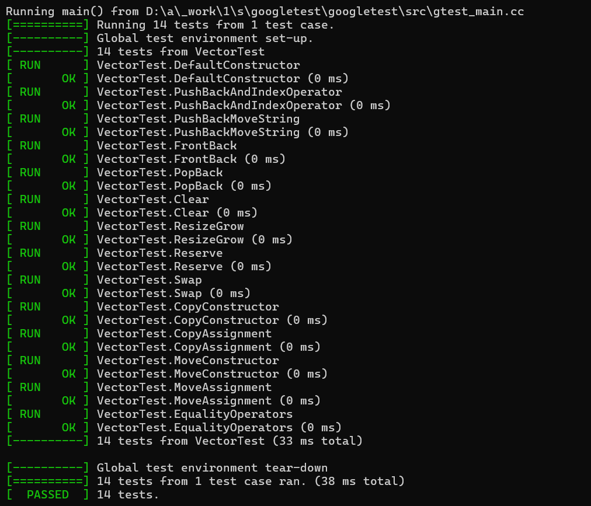
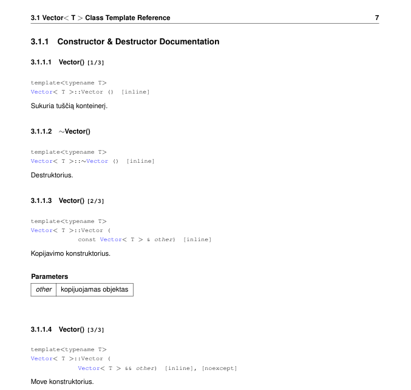
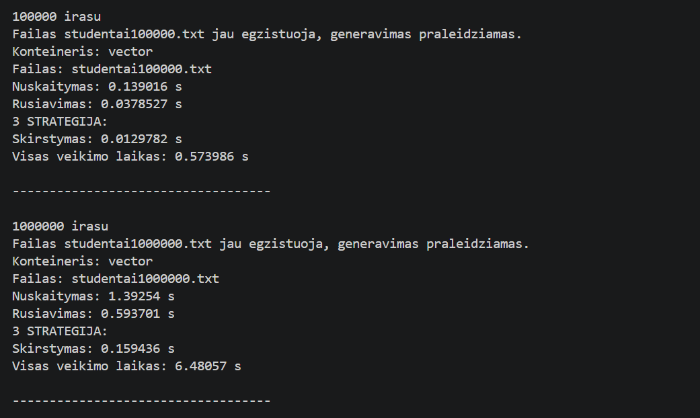
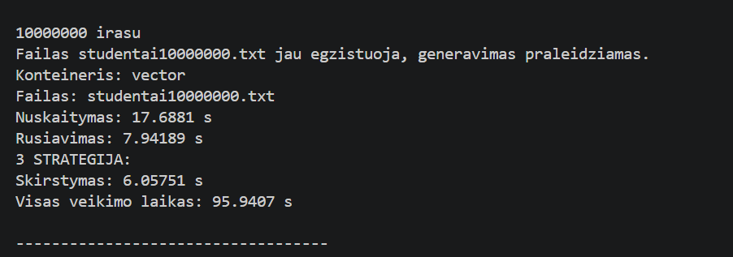
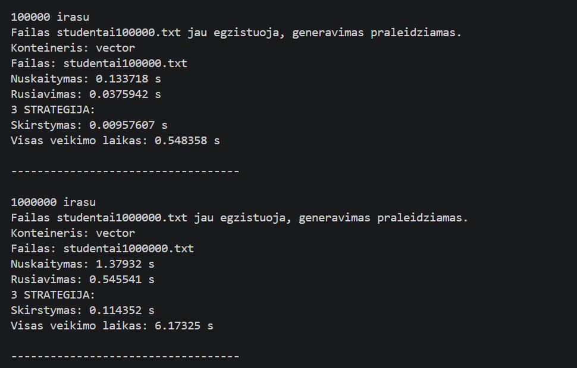
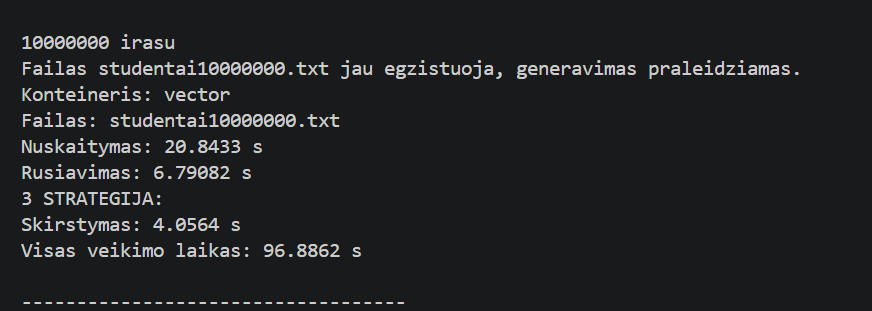
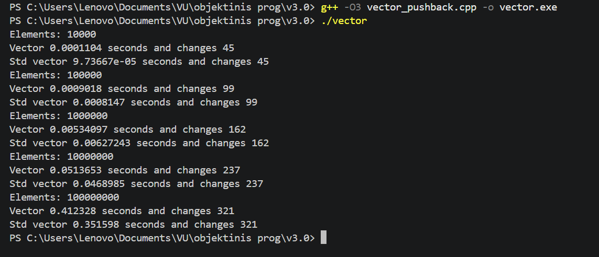

# V3.0

## Programos aprašymas

v3.0 versijoje realizuotas nuosavas `Vector` konteineris, kuris naudojamas vietoje `std::vector`. 

Programa leidžia:

- įvesti studentų duomenis rankiniu būdu
- generuoti atsitiktinius pažymius
- generuoti atsitiktinius studentus
- nuskaityti studentų duomenis iš failo
- apskaičiuoti galutinį balą:
  - pagal vidurkį
  - pagal medianą
- rūšiuoti studentus
- skirstyti studentus į grupes
- atlikti konteinerių spartos analizę

---

## Nuosavas `Vector` konteineris

Sukurtas nuosavas šabloninis `Vector<T>` konteineris, kuris atkartoja didžiąją dalį `std::vector` funkcionalumo.

Realizuotos funkcijos:

- konstruktoriai
- destruktorius
- copy/move assignment operatoriai
- `push_back()`
- `pop_back()`
- `resize()`
- `reserve()`
- `assign()`
- `insert()`
- `erase()`
- `clear()`
- `swap()`
- `front()`
- `back()`
- `at()`
- iteratoriai:
  - `begin()`
  - `end()`
- palyginimo operatoriai:
  - `==`
  - `!=`
  - `<`
  - `>`
  - `<=`
  - `>=`

Nuosavas konteineris pilnai integruotas į pagrindinę programą vietoje `std::vector`.

---
---

## `Vector` funkcijų pavyzdžiai

### `push_back()`

```cpp
Vector<int> v;

v.push_back(10);
v.push_back(20);

std::cout << v[0] << " " << v[1];

Rezultatas: 10 20
```
### `resize()`

```cpp
Vector<int> v;

v.push_back(1);
v.push_back(2);

v.resize(5);

std::cout << v.size();
Rezultatas: 5
```
### `reserve()`

```cpp
Vector<int> v;

v.reserve(100);

std::cout << v.capacity();
Rezultatas: 100
```
### `operator==`

```cpp
Vector<int> a;
Vector<int> b;

a.push_back(1);
b.push_back(1);

if (a == b)
{
    std::cout << "Vienodi";
}
Rezultatas: Vienodi
```
### `erase()`

```cpp
Vector<int> v;

v.push_back(1);
v.push_back(2);
v.push_back(3);

v.erase(v.begin() + 1);

for (auto x : v)
{
    std::cout << x << " ";
}
Rezultatas: 1 3
```


## Unit Testai

Projektui realizuoti Google Tests testai, tikrinantys `Vector` konteinerio veikimą.

Testuojamos funkcijos:

- konstruktoriai
- copy/move operacijos
- `push_back()`
- `pop_back()`
- `resize()`
- `reserve()`
- `clear()`
- `swap()`
- `front()` / `back()`
- palyginimo operatoriai
- iteratoriai
- `erase()`
- `assign()`

### Testų rezultatai



---

## Doxygen dokumentacija

Projektui sugeneruota dokumentacija naudojant **Doxygen**.

Dokumentacijoje aprašyti:

- `Vector` konteineris
- metodai
- operatoriai
- konstruktoriai
- iteratoriai
- programos funkcijos

### Dokumentacijos pavyzdys



---

## Spartos analizė

Atlikta `std::vector` ir nuosavo `Vector` konteinerio spartos analizė.

Buvo lyginama:

- `push_back()` veikimo sparta
- atminties perskirstymų skaičius
- programos veikimo laikas naudojant skirtingus konteinerius

### `std::vector` rezultatai





### `Vector` rezultatai





### Perskirstymų ir push_back veikimo spartos rezultatai



---

## DLL panaudojimas

Projektui sukurtas ir panaudotas DLL failas.

Programa sėkmingai naudoja dinaminę biblioteką (`DLL.dll`) pagrindinės programos veikimo metu.

---

## Programos diegimas

Projektui sukurtas `setup.exe` diegimo failas.

Diegimo metu programa įrašoma į:

```text
C:\Program Files\VU\Vardenis-Pavardenis
```
## Naudojimosi instrukcija

### Programos paleidimas naudojant `setup.exe`

1. Paleiskite `setup.exe`
2. Suteikite administratoriaus teises
3. Pasirinkite diegimo vietą arba palikite numatytąją.
4. Užbaikite diegimą
5. Programą galima paleisti:
- per Desktop shortcut
- per Start Menu:
`VU -> Vardenis-Pavardenis`

## Programą galima paleisti ir su Makefile

### Paleidimas

- Atsidarykite savo OS terminalą
- Jei naudojate Windows, rekomenduojama naudoti MSYS2 aplinką:
- Atsisiųsti: https://www.msys2.org/
- Paleisti „MSYS2 UCRT64“ terminalą
- Įdiegti reikalingus įrankius: pacman -S mingw-w64-ucrt-x86_64-gcc make git
- Įveskite šią eilutę: git clone https://github.com/GintareeJ/Objektinis-3
- Patikrinkite, kuriame branch esate ir įveskite "git branch". Jei branch nėra main, įveskite "git checkout main".
- Pereikite į projekto katalogą: cd Objektinis-3/v3.0
- Įrašykite "make run" norėdami paleisti programą
- Jei norite ištrinti sukompiliuotą failą, įrašykite "make clean"
---
