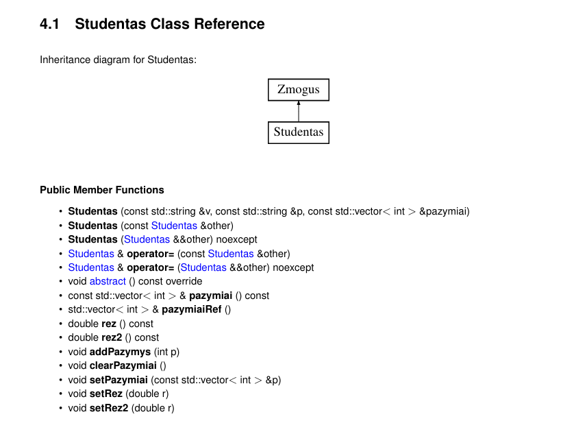
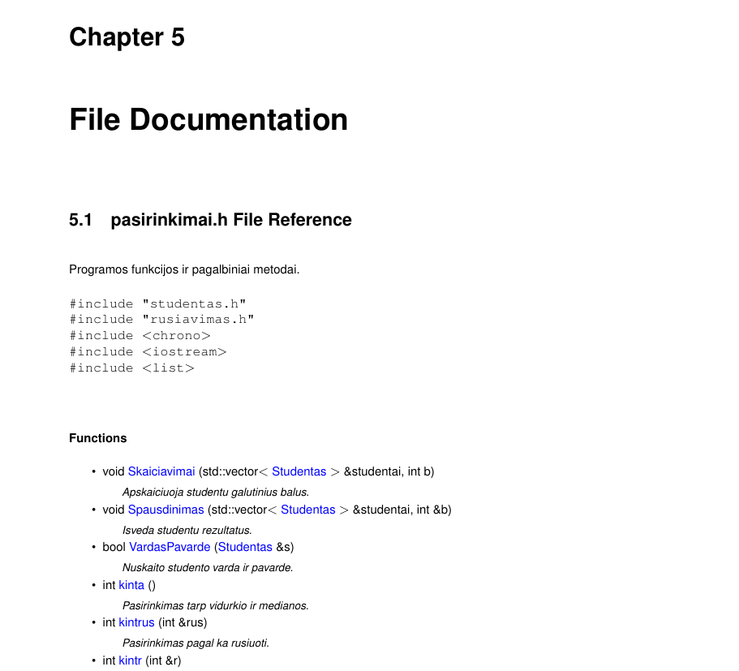
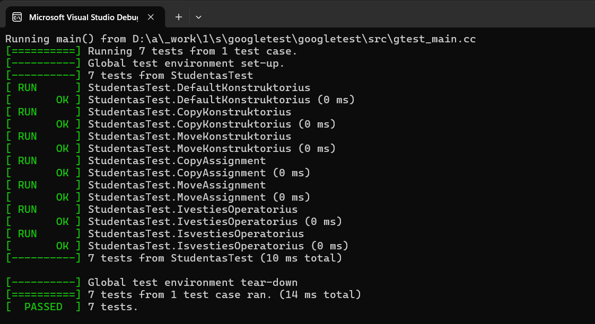

# V2.0

## Programos atnaujinimas

v2.0 versija yra išplėsta ankstesnių versijų realizacija, kurioje pagrindinis dėmesys skirtas:

- projekto dokumentavimui naudojant Doxygen
- Unit Testų realizacijai
- projekto diegimo automatizavimui
- tvarkingos ir pilnai paruoštos GitHub repozitorijos sukūrimui

Ši versija ne tik išlaiko visą ankstesnių versijų funkcionalumą, bet ir paverčia projektą pilnai paruoštu tolimesniam vystymui, testavimui bei naudojimui kitose sistemose.

---

## Doxygen dokumentacija

Projektui sukurta pilna dokumentacija naudojant **Doxygen**.

Dokumentacijoje aprašyti:

- klasės
- metodai
- konstruktoriai
- destruktoriai
- operatoriai
- paveldėjimo struktūra
- failų priklausomybės

Sugeneruoti dokumentacijos formatai:

- HTML dokumentacija
- LaTeX dokumentacija
- PDF dokumentacija

### Dokumentacijos pavyzdžiai

---

## Unit Testai

v2.0 versijoje realizuoti Unit Testai naudojant C++ testavimo framework'ą - Google tests.

Testavimo metu tikrinamas korektiškas klasės `Studentas` veikimas.

Testuojami komponentai:

- konstruktorius
- copy konstruktorius
- move konstruktorius
- copy assignment operator
- move assignment operator
- destruktorius
- įvesties operatorius
- išvesties operatorius
- objektų kopijavimas konteineriuose

### Testų rezultatai

---

## Programos diegimas

Projektui paruoštas **Makefile** diegimo failas.

### Projekto paleidimas

- Atsidarykite savo OS terminalą
- Jei naudojate Windows, rekomenduojama naudoti MSYS2 aplinką:
- Atsisiųsti: https://www.msys2.org/
- Paleisti „MSYS2 UCRT64“ terminalą
- Įdiegti reikalingus įrankius: pacman -S mingw-w64-ucrt-x86_64-gcc make git
- Įveskite šią eilutę: git clone https://github.com/GintareeJ/Objektinis-2
- Patikrinkite, kuriame branch esate ir įveskite "git branch". Jei branch nėra main, įveskite "git checkout main".
- Pereikite į projekto katalogą: cd Objektinis-1/v1.0
- Įrašykite "make run" norėdami paleisti programą
- Jei norite ištrinti sukompiliuotą failą, įrašykite "make clean"
---

## Programos funkcionalumas

Programa leidžia:

- nuskaityti studentų duomenis iš failo
- įvesti duomenis rankiniu būdu
- generuoti atsitiktinius studentus
- apskaičiuoti galutinį balą:
  - pagal vidurkį
  - pagal medianą
- rūšiuoti studentus
- skirstyti studentus į grupes
- naudoti skirtingus konteinerius:
  - `vector`
  - `list`
  - `deque`
- matuoti veikimo laikus

---

## Išvados

- Doxygen dokumentacija leidžia lengvai suprasti projekto struktūrą
- Unit testai padeda užtikrinti kodo stabilumą
- TDD metodika leidžia saugiau plėsti projektą
- CMake leidžia paprastai kompiliuoti projektą skirtingose sistemose
- Projektas pilnai paruoštas tolimesniam vystymui

---

# Ankstesnės versijos

# V1.5

#### Programos v1.5 versija:

- realizuotas paveldėjimas
- sukurta base klasė
- base klasė padaryta abstrakčia
- sukurta derived klasė
- pakartoti Rule of Five testai
- išlaikytas visas ankstesnis funkcionalumas
  
#### Išvados

- abstrakti klasė leidžia geriau organizuoti programos architektūrą
- paveldėjimas leidžia lengviau plėsti projektą
- funkcionalumas išlieka stabilus

---

# V1.2

#### Programos v1.2 versija:

- realizuota Rule of Five
- perdengti įvesties ir išvesties operatoriai
- realizuoti klasės testai
- pagerintas atminties valdymas
- įdiegtos move operacijos

#### Išvados

- move semantika sumažina nereikalingą kopijavimą
- pagerintas programos efektyvumas
- klasė tapo universalesnė

---

# V1.1

#### Programos v1.1 versija:

- nuskaito studentų duomenis iš failo
- apskaičiuoja galutinį balą
- rūšiuoja studentus
- skirsto studentus į grupes
- leidžia naudoti `vector`, `list`, `deque`
- matuoja veikimo laikus
- atliktas struct ir class palyginimas

#### Išvados

- struct versija kai kuriais atvejais veikia greičiau
- optimizavimo flagai pagerina veikimo greitį
- sumažėja galutinio executable failo dydis
